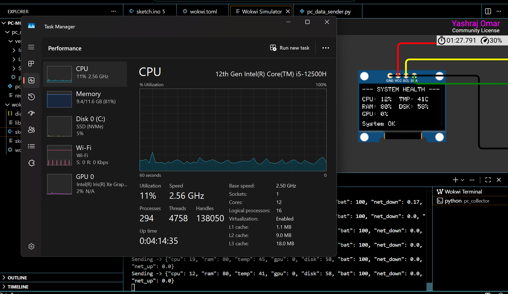

# ESP32 Real-Time PC Health Monitor

A real-time embedded telemetry system that streams live PC health metrics to an ESP32 firmware environment and displays them on an SSD1306 OLED dashboard.

The project demonstrates the complete flow of an embedded monitoring system — data acquisition, communication protocol design, firmware processing, and real-time visualization.

---

## Demo

### OLED Dashboard



*Live CPU/RAM/disk/temperature monitoring with automatic system health alerts.*

### End-to-End Data Flow

[<video src="docs/demo.mp4" controls width="700"></video>](https://github.com/YashrajOmar/ESP32-PC-Health-Monitor/raw/main/docs/demo.mp4)

*Python Collector → TCP Socket → ESP32 Firmware → OLED Display*

---

## System Architecture

```text
+-------------------------+
|       PC Collector      |
|-------------------------|
| Python + psutil         |
|                         |
| Reads:                  |
| CPU Usage               |
| RAM Usage               |
| Disk Usage              |
| Temperature             |
| GPU / Network Stats     |
+-------------------------+
            |
            |
            | JSON Telemetry @ 1Hz
            | TCP Socket
            |
            v
+-------------------------+
|     ESP32 Firmware      |
|-------------------------|
| JSON Parsing            |
| Data Processing         |
| Threshold Monitoring    |
| Alert Generation        |
+-------------------------+
            |
            |
            | I2C Protocol
            | SDA / SCL
            |
            v
+-------------------------+
|    SSD1306 OLED UI      |
|-------------------------|
| Real-Time Dashboard     |
| System Health Alerts    |
+-------------------------+
```

---

## Features

- Real-time CPU, RAM, disk, temperature, GPU, and network monitoring
- Lightweight JSON-based telemetry protocol
- ESP32 firmware written in C++
- SSD1306 OLED dashboard using I2C communication
- Embedded-side threshold monitoring and alert generation
- Controlled data streaming to avoid communication bottlenecks
- Modular architecture for adding new metrics and sensors

---

## How It Works

1. The Python collector reads live system metrics using `psutil`.

2. Metrics are serialized into JSON packets:

```json
{
  "cpu": 25,
  "ram": 70,
  "temp": 45,
  "disk": 58
}
```

3. The telemetry packet is transmitted to the ESP32.

4. ESP32 firmware:
   - receives the data
   - parses JSON
   - updates internal state
   - checks alert conditions

5. Processed information is displayed on the OLED screen.

---

## Engineering Challenges Solved

### Communication Layer

The first implementation explored serial communication. During testing, driver-level limitations and synchronization issues created unnecessary complexity.

The communication layer was redesigned using TCP sockets, resulting in a simpler and more reliable telemetry pipeline.

### Data Synchronization

The sender originally produced data faster than the receiver needed.

A controlled 1Hz update cycle was implemented to match real display requirements and prevent unnecessary buffering.

### Embedded Processing

Instead of treating the ESP32 as only a display controller, processing responsibilities were moved closer to the device:

- message parsing
- state management
- threshold checking
- alert decisions

---

## Project Structure

```text
ESP32-PC-Health-Monitor/

├── pc_collector/
│   ├── pc_data_sender.py
│   └── requirements.txt
│
├── wokwi_esp32/
│   ├── sketch.ino
│   ├── diagram.json
│   ├── wokwi.toml
│   └── sketch.ino.bin
│
├── docs/
│   ├── demo.png
│   └── demo.mp4
│
├── README.md
└── .gitignore
```

---

## Setup

### 1. Start Python Collector

```bash
cd pc_collector

pip install -r requirements.txt

python pc_data_sender.py
```

The collector starts streaming live telemetry data.

---

### 2. Run ESP32 Firmware

Open the ESP32 project environment and run:

```
sketch.ino
```

The firmware receives telemetry packets and updates the OLED dashboard.

---

## What This Project Demonstrates

- Embedded C++ firmware development
- ESP32 programming
- Hardware/software communication
- I2C peripheral interfacing
- Real-time telemetry systems
- Python system programming
- Protocol design using JSON
- Debugging communication bottlenecks
- Simulation-based embedded prototyping

---

## Future Enhancements

- Implement MQTT-based wireless telemetry communication
- Add TinyML-based anomaly detection for Edge AI inference
- Add historical telemetry logging and trend analysis
- Optimize firmware memory usage and processing efficiency
- Support multiple monitoring devices
- Add configurable alert rules and monitoring profiles

---

## Tech Stack

- ESP32
- Embedded C++
- Python
- psutil
- TCP Socket Programming
- JSON
- SSD1306 OLED
- I2C Protocol
- Wokwi
